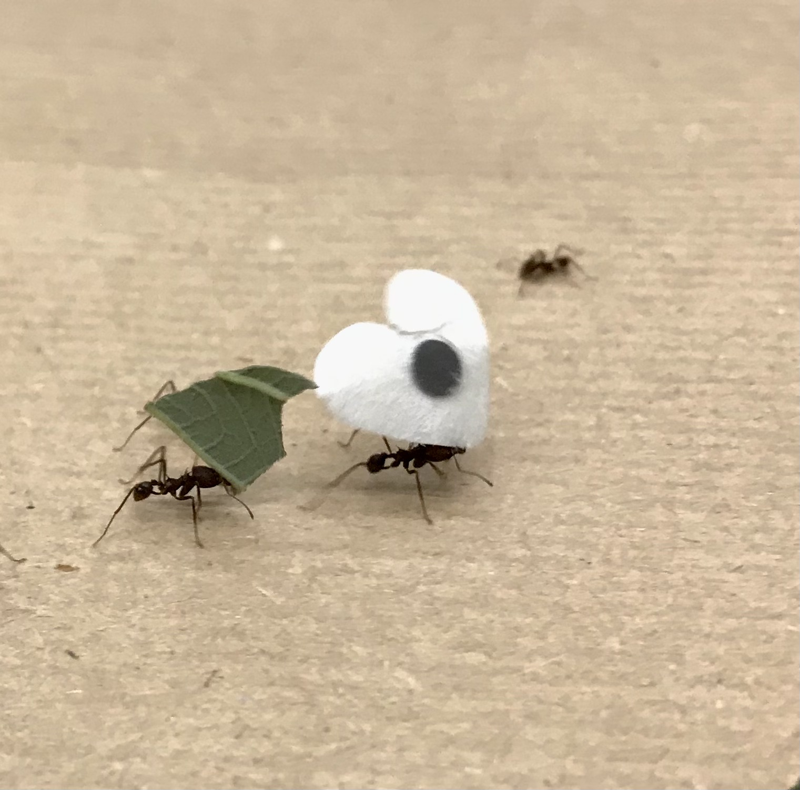

<!-- pictures of the experiment and fragments -->

# Introduction
### the experiment ...

- 30m trail for leafcutter ants
- 42 fragments marked for motion capture
- **WANT**: 2D motion capture over whole trail
```{r picture, eval=TRUE, echo=FALSE}



```


--

### ... and its problems

- camera positions not optimal
- marker transported vertically
- **PROBLEM**: identity loss during motion capture

---
# Main part

- over 3,800 tracklets in 2h recording
- stitch tracklets into 42 tracks
- automate stitching process (>80,000 tracklets total)

```{r hist, eval=TRUE, echo=FALSE, fig.show="hold", out.width="50%"}

## plot start- and end-points
stitching_data_first = read.table("C:/Users/timte/Desktop/PhD Konstanz/Chain transport - partial data, R script/Github repository/stitching_data_first.txt") 
stitching_data_last = read.table("C:/Users/timte/Desktop/PhD Konstanz/Chain transport - partial data, R script/Github repository/stitching_data_last.txt")
stitching_data_first = as.matrix(stitching_data_first); rownames(stitching_data_first) = NULL; stitching_data_first[,"X"] = stitching_data_first[,"X"]/1000
stitching_data_last = as.matrix(stitching_data_last); rownames(stitching_data_last) = NULL; stitching_data_first[,"Y"] = stitching_data_first[,"Y"]/1000

plot(jitter(stitching_data_first[,"X"],50), jitter(stitching_data_first[,"Y"],50), 
     pch=16, col=scales::alpha("#3c8c5c",0.1),
     xlim=c(-4,4.5), ylim=c(-2.5, 9), 
     xlab="", ylab="")


## load data
concise_data = read.table("C:/Users/timte/Desktop/PhD Konstanz/Chain transport - partial data, R script/concise_data.txt"); concise_data = as.matrix(concise_data); rownames(concise_data) = NULL

## histogram
hist(log(table(concise_data[,"ID"])), xlab="length (log frames)", col=scales::alpha("#3c8c5c",0.8),
     main="")
abline(v=log(10)); text(log(10), 1350, "1 sec", pos=4) ## one second
abline(v=log(600)); text(log(600), 1350, "1 min", pos=4) ## one minute
abline(v=log(60*60*10)); text(log(60*60*10), 1350, "1 hour", pos=4) ## one hour
```


